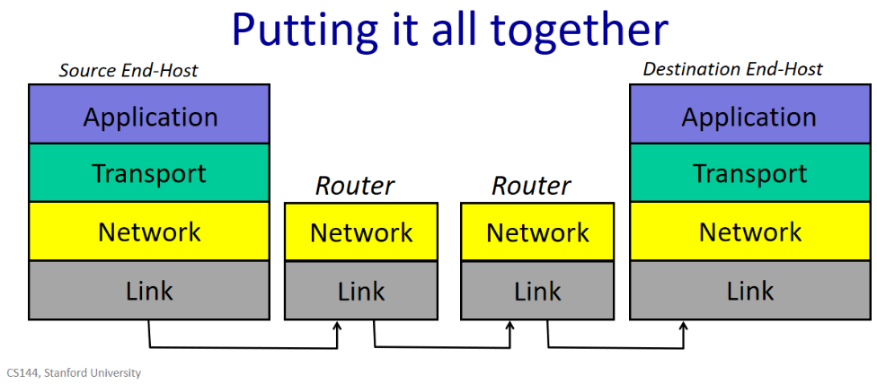
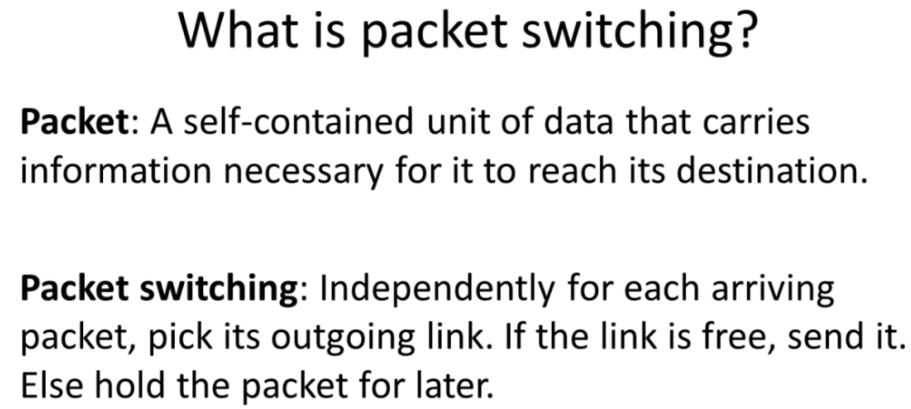
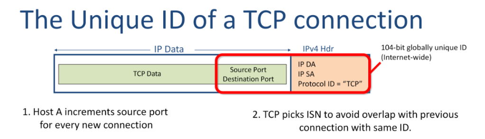
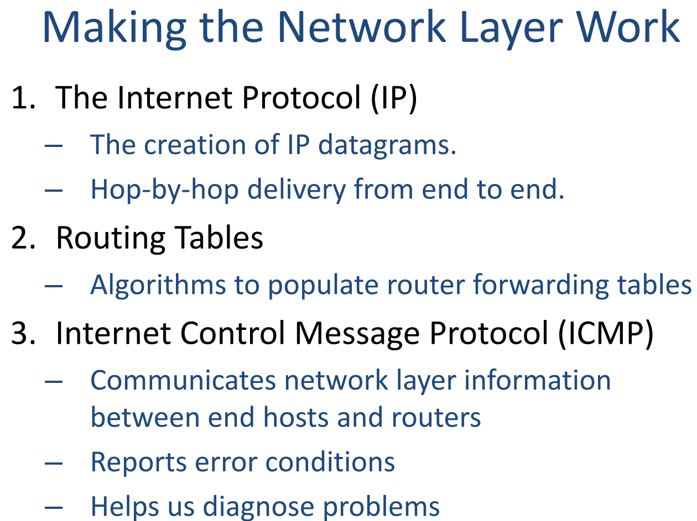
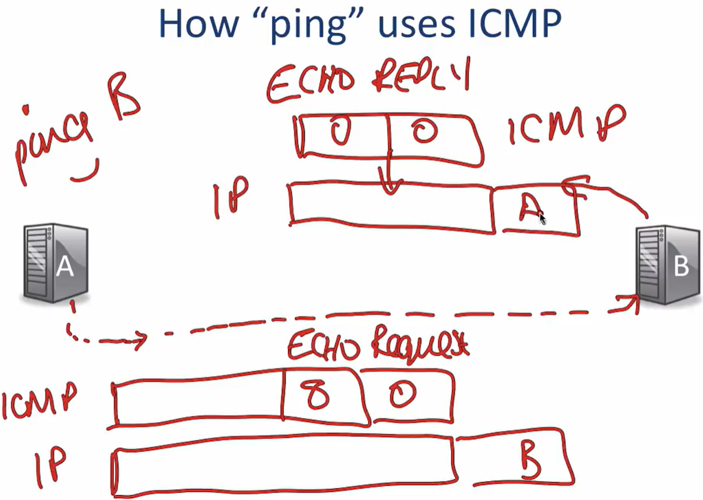

<<<<<<< HEAD
# CS144

## Part 1 The Internet and IP

### 1-2 The 4 Layer Internet Model




​	为什么IP会被称为”thin waist”，是因为在network layer我们只有 IP 这一种选择。然而在link layer，我们可以使用Ethernet、WiFi、3G、4G接入网络，在transport layer，也有着TCP、UDP、RTP等多种协议，而在application layer上，同样拥有着various protocols, such as http, smtp, ssh and etc..

### 1-3 The IP Service Model


- Datagram: 关于datagram的传输行为在前面也已经谈过了，hop-by-hop指的是一个个router进行传输。
- Unreliable: 正如之前所谈到的，IP service不会保证每个封包都会被正确地传输，甚至也不会保证这些封包会最终被传输到destination, there are no guarantees.
- Best effort: 这个特点其实可算是unreliable一个衍生，best effort代表了IP不会随意乱drop packets, 只有在必要的情况下drop packets正如Professor Nick所提到的那样( *but only if necessary*), 举个例子，当一个router packet queue因为congestion导致fill up, IP会drop接下来的packets, 但IP不会通知source端resend this packet, 同样地，如果router的forwarding table是错误的造成了packets发往错误的destination or 造成packets错误地复制，这些情况IP不会保证错误不会发生，也不会保证会侦测到错误，但IP保证会只在一些必要(我觉得这里用无法避免，更为贴切)的情况下犯错。
- Connectionless: IP并不会评估终端的情况，只是安排分发每个datagram，就造成了上表所说的no per-flow state, 每个datagram又是单独处理，就可能造成packets mis-sequenced.


### 1-4 The Life of a Packet


​	第一次握手是client端发送”synchronize” message给server, 简记作SYN, 当server收到了这则讯息之后，会回应一则synchronize message, 这则讯息代表了server acknowledges the client “synchronize”, 所以这则消息也被称为SYN, ACK, 这便是TCP的第二次握手，而第三次握手是指client acknowledges the server’s synchronize, 这则消息被缩写为ACK. 所以三次握手可以被描述为”synchronize => synchronize, acknowledge => acknowledge”, 可以精简地表示为”SYN => SYN, ACK => ACK”.

### 1-5 Packet Switching Principle




### 1-6 Layering Principle


### 1-7 Encapsulation Principle


​	Professor Phil也提到了，对于封装还可以是recursively, TCP理论上也是有机会封装TCP的，并且Professor Phil也以virtual private network (VPN)这项技术进行了举例说明。VPN具体来说就是允许客户与VPN供应商的网络建立安全连接，比如Transport Layer Security (TLS), TLS封包内部的数据是加密的，接着在TLS外面进行封装。

### 1-8 Byte Order

```python
>>> from sys import byteorder
>>> print(byteorder)
little
```

### 1-9 IPV4 Addresses


​	由Internet Assigned Number Authority (IANA)负责发放IP address给各个大陆的Regional Internet Registries (RIPs), 再由该大陆的RIPs发放IP address给各个国家。Professor Phil也提到了现在很多新闻报道都说IPv4的地址被用完了，其实并不完全如此，准确来说IANA和RIPs是将/8 的IPv4 addresses用完了。其实每个大陆能够发放的IP address只有$2^{24}=16777216$个IP addresses. 当然应对IPv4 addresses日渐枯竭的问题，转移到IPv6 addresses上正是业界正在做的事情。

### 1-10 Longest Prefix Match


### 1-11 Address Resolution Protocol (ARP)

​	在同一局域网内在传输封包的时候，由于必须要知晓对方设备的MAC address才能传输，假设我们已经知晓了目的端的IP address了，那么我们该如何知晓目的端所对应的MAC address呢？这个问题的答案就是***Address Resolution Protocol (位址解析协议)***，简写为ARP, 这个协议中的解析之意，我想是将IP address 解析为 MAC address吧. 值得一提的是，IP address和MAC address其实是一一对应的关系，而不是一个IP 对应多个MAC address, 为什么是这样的设定，Professor Phil也给出了解释，我用课件的截图辅助说明一下：


​	在这个例子中，假设host A与host B不在同一网段通讯必须要使用gateway 或者说经过IP router才能完成通讯，然而gateway为了与host B通讯，那么host B的netmask需要设置为128.0.0.0,然而这与host A与host B不在同一网段的假设所相矛盾，所以为了解决这个问题，一个gateway或者说router是有多个interface (接口/界面)，每个interface都有自己的MAC address和IP address, 如下图所示:


​	那么现在host A在与host B进行通讯时，host A所发出的封包的destination IP address是171.43.22.5, 而destination MAC address就是00:18:e7:f3:ce:1a, source IP address为191.168.0.5, source MAC address则为00:13:72:4c:d9:6a. Gateway收到这个封包之后依据forwarding table则会将这个封包发往B.

​	为了完成通讯任务，在同一网段下的host A就必须知晓gateway的MAC adddress, 此时ARP就派上用场了。


​	ARP 是一个简单的request-reply protocol, host 1一开始会在ARP request里询问谁有IP address X, 并且以broadcast (广播) 的形式发出去，广播的MAC address是ff:ff:ff:ff:ff:ff, 之后IP address 为X的host 2收到了这则讯息会以unicast (单播)的形式reply 这则讯息，由此建立mapping的关系。当然，因为是广播，在同一个局域网中，其它的节点也会依据host 1在ARP request中所写的IP address和MAC address建立起mapping的关系。这种mapping的关系也是有时间限制的，Cisco的设备记录mapping的timeout是4 hours, 不同设备之间的mapping持续时间也不同。

​	ARP packet format如下图所示:


Hardware: 通常是Ethernet (0x0001)

Protocol: IP (0x0800) / IPv6 (0x86DD)

Hardware length: 硬件地址的长度，通常为6

Protocol length: 通常以IPv4为主，为4

Opcode: ARP request是1, ARP reply是2

注意，Hardware length的单位应该是bytes, 不是bits.


​	这里的情况是gateway 回应由192.168.0.5所发出的ARP request. 其它的网络节点会因为ARP request中的讯息，更新192.168.0.5对应的MAC address是68:a8:6d:05:85:22.

​	在这节课的最后，Professor Phil也提到了原来ARP reply要求单播，现在广播ARP reply的做法也很常见，但这样会造成一旦mapping 改变了，会more aggressively replace cache entries. 同样现在还有一种叫做***gratuitous ARP (免费ARP)***的机制，Professor Phil说起gratuitous ARP的原话是in order to advertise themselves on a network. 想想也是他自己发一个自己的IP address + MAC address, 并且destination IP address也是自己的IP address以广播的形式发出去，这样做的好处 1)这则讯息理论上不会回复，但如果有设备回复了，说IP address冲突了，这样可以发现系统IP 冲突的错误； 2) 假设发送gratuitous ARP的设备因为某个原因更换了MAC address, 可以及时通知同一网络中的其它节点。

## Part 2 Transport

### 2-1 TCP service model


​	第一次握手：A向B发送一个SYN, 并且在这则讯息中会携带A的sequence number。这里我补充一下，这个sequence number是随机产生的，它的范围是$0\leq \text{sequence number} \leq 2^{32}-1$。至于为什么是随机产生的，这个会在之后谈到它的原因。这个***sequence number (序列号)***在TCP中扮演了重要的角色，但首先要明确这个sequence number并不是特指某一个packet or 某一个segment or 某一个flow, sequence number 代表了TCP的byte stream中第一个byte在TCP data field中所对应的位置，我这里会补充Professor Nick所用的原文方便大家理解: ***“The Sequence number indicates the position in the byte stream of the first byte in the TCP Data field.”*** 这个概念其实不太好理解，我曾经想当然地把这个sequence number认为是一条TCP segment ID之类的东西，希望这种错误不会发生在其它人的身上，如果理解错了之后会有些混乱。第一次握手如果生动形象的表达的话就是: A对B说，老哥啊，我现在想跟你同步信息，你在x的位置开始读这则讯息哈。

​	第二次握手：B会回应A，发送SYN+ACK告知A自己已和它同步了。那么B是通过什么信息告知A成功同步的消息呢？答案就在acknowledgment number中，acknowledgment number里面的数字是先前A所发送的sequence number + 1. Acknowledgment number告诉了其它端口，我们下一次希望从哪里开始读起，附上Professor Nick的原文定义: ***The Acknowledgment sequence number tells the other end which byte we are expecting next.*** 同样地，B也会将自己sequence number发送给A, 便于A进行同步。第二次握手用大白话来说就是，B对A说小老弟啊，咱们讯息同步了，你下次写在x+1的地方开始写起，然后你从y的位置开始读这则讯息。

​	第三次握手：A也会回应B，告知B自己已经和它建立了双向连接，同时也会更新自己的sequence number和acknowledgment number, 第三次握手可以通俗地表示为：A对B说，老哥你在x+1的地方开始看，下次回信请在y+1的位置开始写。


1. 发送acknowledgements告知对方，数据已经正确地到达。
2. checksum可以侦测封包是否有损坏。
3. sequence number来检测是否有遗失data，因为一旦遗失data，这个sequence number就会不正确。
4. flow-control是针对于两个通讯端，二者的传输能力相差较大的情况，比如A和B通讯，但A的发得非常快，以至于B都cannot keep up. TCP 为了防止上述情况发生，于是会有flow- control的机制，它会告诉sender接收者的buffer还有多少空间来accept new data, 防止发送者发送过多信息，淹没了接收者。


Destination port, 这个栏位其实是告诉对方终端现在是使用什么service，举个例子，当TCP 携带了Web data, 那么destination port则是80：在这里可以去*IANA*上查询具体的端口：[Service Name and Transport Protocol Port Number Registry (iana.org)](https://www.iana.org/assignments/service-names-port-numbers/service-names-port-numbers.xhtml?&page=1)

Source port, 这个栏位可以告知另一端应该往哪个端口send data back.

Sequence number, byte-stream中first byte所对应的位置就是sequence number.

Acknowledgement sequence number, 告知另一端，我们期望下一个sequence number是多少，同时acknowledgement sequence number还表示了另一层含义，假设我们的acknowledgement sequence number为x, 那么代表我们已经正确无误地收到了前x – 1个bytes.

Checksum, 通过计算checksum, 我们可以知道封包中的data是否有损坏。

Header length, 用告知这个TCP header的长度。

- ACK: 表明了已经成功接收到了packet, 并且证明acknowledgement sequence number是有效的。
- SYN: 告知对方需要同步，也是建立TCP 连接的第一步。
- FIN: signaling the closing of one direction of the TCP connection.
- PSH: 带有PSH flag的segment告知TCP这笔数据需要被快速推出，而不是等待TCP buffer满了以后再出去，在接收端的transport layer, 一旦发现PSH flag = 1的segment这个packet会立马送往application layer.
- URG: URG是英文urgent (紧急的；急迫的) 的缩写，当receiver 收到带有URG flag的封包时，这笔资料会被马上送往application layer, 并且提示接收端这些带有URG flag的资料需要被优先于其它资料进行处理
- RST: 当TCP sender发现有一些异常情况，例如接收数据超时或是发现一个conversation 根本不应该存在时，那么TCP sender会发送带有RST flag的segment, TCP receiver收到之后不需要ACK, 此时不会像FIN一样单方面关闭TCP connection, 而是双方都停止通讯，并且不必等待TCP buffer满了才发RST, 而是直接丢弃TCP buffer里的数据，直接发RST, RST会造成数据丢失，而FIN是不会有data loss.




​	这里的unique主要指的是source port and initial sequence number (ISN).

​	为了使得TCP source port 不同，host will increase source port number for each new connection. 因为source port这个栏位有16 bits, 那么意味着可以有$2^{16}$个不同的TCP source port.

​	然而Professor Nick认为这种方法还是会有产生相同的TCP source port的风险。假设之前相同的host pair使用了跟不久之前一样的port pairs, 并且一些earlier connection所发送的TCP segment在网络中可以存活较长的时间，比如它卡在了某个router buffer, 那么为了让现在的connection和earlier connection有所区隔，降低old segment as ongoing transfer的风险，于是我们会随机生成一个Initial sequence number来区隔earlier connection and ongoing connection.

​	为了应对或者说减少这种confusion的情况，传送者和接收者会随机产生一个initial sequence number (ISN)来告知双方TCP connection byte-stream中first byte的位置。这样可以减少混淆的情况。


### 2-2 UDP service model


UDP的header只包含了4个fields, 而TCP则是10个fields. 也正是因为不需要保证交付的设计概念，使得UDP header变得如此简单。

Source port, 这个port的作用与TCP header的source port的作用是一致的，让receiver可以正确地发送信息给sender所对应的application.

Destination port, 这个port的作用其实也与TCP header的destination port的作用是一致的的，使datagram可以正确发往receiver中所对应的service/application.

Length, 这是一个16 bits的field, 它记录了整个UDP datagram (包含header和data) 的总长度。这个length最小是8 bytes, 因为这是UDP header的长度。

Checksum, 这个栏位是可选的，如果sender不想要去计算checksum, 这一栏则为零，如果需要的话，这一栏的计算会包含部分IP header的信息，来检测是否发往了错误的destination host. 当然这种做法违背了layering principle, 但Professor Nick认为这种violation是合情合理的，因为使用下层的信息, UDP可以进行wrong destination的侦错检查。


​	首先要明确的是UDP datagram是self contained datagrams该有的信息都写在了datagram里面了，UDP layer如果收到UDP datagram自然会正确地处理。但UDP提供的服务是connectionless的，没有像TCP那样建立连接，并且因为封包并没有像TCP那样具有sequence number, 而是datagram到了就上传给application layer, 这样会造成packets会乱序，它可以出现在任意位置。

​	此外，UDP是unreliable delivery, 它没有acknowledgements, 即使UDP datagram都在传输过程中丢了，它仍然不会通知sender重传. 但是一些application要是有自己的重传机制，其实是可以使用UDP的，例如network file system (NFS). 同样地，UDP 没有侦测packet missing或者乱序的机制，并且它也不会像TCP具有flow control的机制。它就好像一个处于transport layer的IP一样，那么我们为什么需要UDP呢？

​	UDP除了unreliable delivery以外还有一个特点就是simple, 而simple就意味着它非常的lightweight and fast, 因此UDP被一些simple request-respond applications, such as Domain Name System (DNS), Dynamic Host Configuration Protocol (DHCP), and Network Time Protocol (NTP)上面所应用。但现在已经很少的影音传输会用到UDP了，因为现在的影音传输主要是在http上进行传输，而http的无记忆应答方式加上UDP的不可靠传输，简直是噩梦组合，所以现在http基本上会基于TCP进行传输，因此现在的线上影音传输主要还是依赖于TCP。

### 2-3 ICMP service model




在这里可以去*RFC 792*上查询具体的type和code：[RFC 792 - Internet Control Message Protocol (ietf.org)](https://datatracker.ietf.org/doc/html/rfc792)

下面是Ping的例子：


下面是traceroute的工作原理：


### 2-5 Error Detection: 3 schemes


​	Checksum相当简单，simple means fast, 所以checksum很容易并且可以很快速地运算得出结果，但checksum也因为太过于简单，也造成了它对于侦测错误上面非常的weak. 如果packet中单个位元发生错误，那么checksum可以保证能侦测到，但是如果packet中发生的错误不止一处，那么就有可能导致sum的结果不变从而使得checksum不能侦测到这些错误。


​	CRC, 中文名为循环冗余校验，CRC在link layer上面使用得比较常见，并且为了提供更好比checksum更好的侦错效果，它的算法比checksum更加复杂。

​	首先，我们要明确一个目的，CRC是将n bits的data转变成c bits来表示，并且c是远小于n的，这就像某种映射关系，而这个c bits的数据就是CRC remainder. 那么如何得到这个CRC remainder 呢？长除法会是我们的工具。因为对于数论上的有限域和群论的知识不是很了解，关于多项式之间的转换和证明之类的我就不谈了吧，我直接进入如何用长除法来进行CRC的运算的部分。对于n bits的data我们称作M, 需要用二进制的方式来表示这个数据M，接着在这组数据后面填充c个0。 之后就来到了CRC中最重要的部分就是G, 也就是generator polynomial, 这里提一下，就是G的第一位永远是1, G同样也用二进制来表示，G的位数是c + 1。

​	接着我们就需要用长除法，M除以G, 这里二进制的除法是没有进位的，并且用XOR代替了减法，最后得到的c bits的余数就是CRC remainder了。最后，我们需要将这个CRC remainder接在原来n bits的M后面，形成新的数据M’, 当接收端收到这个新数据M’, 那么直接将M’用长除法除以G, 若结果为0, 则数据正确，若不为0，则说明数据中有部分错误。

CRC虽然比起checksum要强大了不少，可以侦测多个错误了和一连串的错误了，但它同样并非无懈可击, Professor Phil就有提到，有$2^{-c} $的概率会使得两个不同的封包拥有相同的CRC remainder, 同样地对于多个错误发生的间隔超过c bits, CRC同样不能保证能够侦测到这些错误。


​	当sender要发送一个message M给receiver的时候，他会把双方公有的key K和M作为输入，交给MAC algorithm得到一个MAC1，这个MAC值和message M一起发往receiver, receiver会用同样的key K和message M放入相同的MAC algorithm算出一个MAC2, 如果MAC1=MAC2, 那么这个信息是真实可信的，如果不等的话，这则信息是不可信的。

​	MAC主要针对的是安全加密，而不是像checksum和CRC去着重于数据中是否有像flip data这种错误的机制。

### 2-7 Flow Control: Stop and Wait


### 2-8 Flow Control: Sliding Window


=======
Stanford CS 144 Networking Lab
==============================

These labs are open to the public under the (friendly) request that to
preserve their value as a teaching tool, solutions not be posted
publicly by anybody.

Website: https://cs144.stanford.edu

To set up the build system: `cmake -S . -B build`

To compile: `cmake --build build`

To run tests: `cmake --build build --target test`

To run speed benchmarks: `cmake --build build --target speed`

To run clang-tidy (which suggests improvements): `cmake --build build --target tidy`

To format code: `cmake --build build --target format`
>>>>>>> lab/check1-startercode
